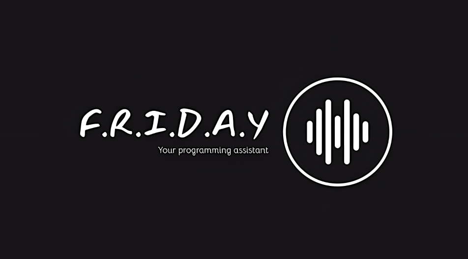

<h1 align="center">Programming Assistant</h1>

    </a> 
 

 <!-- line breaker -->

<!--- header ---->

<h3 align="center" style="color:blue;"> 
<i>DESCRIPTION</i>
</h3>

 <!-- line breaker -->
  
 ## Objective  
 - simplify all programming-related tasks using voice commands 
 - automate all manual repeated tiresome programming-related tasks
 
 ## Features 💡
 
 
 1. create new  repository by voice command ✅
 2. clone the created repository into the local machine by voice command ✅
 3. clone others repositories by voice command ✅
 4. take notes or ToDo's in  by voice command ✅
 5. take screenshots by voice command ✅
 6. help with finding solutions to errors by voice command ✅
 7. open websites ( often visiting sites ) by voice command ✅
 8. easing Websearch by voice command ✅
 9. play music ✅
 10. write texts in screen for you by voice command ✅
 11. language translation [eg: translate english to hindi ] ✅ 
 12. ..............🔜
 

 

## Supported OS 
* ### Linux 

## Tested OS
* ### Ubuntu 22.04.1 LTS 

## 

 <!-- line breaker -->

<h3 align="center" style="color:blue;"> 
<i>HOW TO USE</i>
</h3>
 <!-- line breaker -->

 <!--- footer --->
 

 <!-- line breaker -->

 <a href="https://www.linkedin.com/in/adil-rahman-80b17a23a/"  >connect with me</a>  
   

